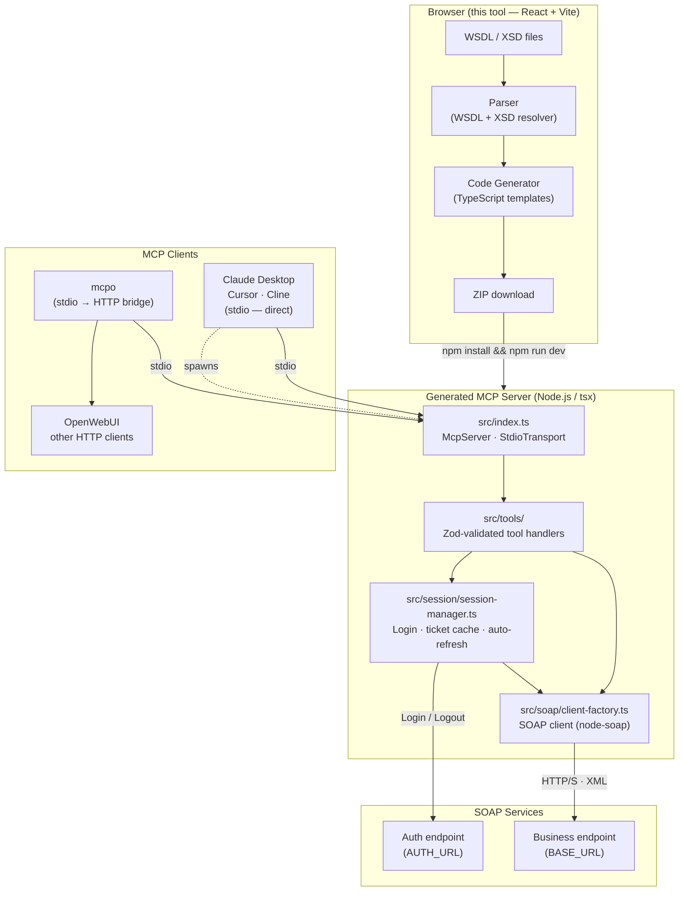

# WSDL to MCP

A browser-based tool that converts SOAP/WSDL service definitions into fully-typed [Model Context Protocol (MCP)](https://modelcontextprotocol.io) projects — ready to drop into any MCP-compatible AI agent.

## What it does

Point it at a WSDL file (local or URL) and it generates a complete, runnable MCP server project:

- Parses WSDL and XSD schemas, resolving imports and complex type hierarchies
- Maps SOAP operations to MCP tools with typed input/output schemas (Zod + JSON Schema)
- Generates a TypeScript MCP project with session management, XML↔JSON conversion, and error handling
- Includes an in-browser playground to test the generated tools against a live LLM

## Getting started

```bash
npm install
npm run dev
```

Then open `http://localhost:5173` in your browser.

## How to use

1. **Upload** — Drop a `.wsdl` file or load one from a URL (with optional CORS proxy)
2. **Configure** — Set the project name, target namespace, and which operations to include
3. **Review** — Preview all generated files before downloading
4. **Download** — Get a ZIP of the complete MCP project
5. **Try it out** — Test your tools interactively in the browser playground

## Generated project

The downloaded ZIP contains a ready-to-run MCP server with:

| File | Purpose |
|------|---------|
| `src/index.ts` | MCP server entry point |
| `src/tools/` | One file per SOAP operation, with Zod schemas |
| `src/soap/client-factory.ts` | SOAP HTTP client |
| `src/utils/xml-to-json.ts` | XML↔JSON conversion |
| `src/session/session-manager.ts` | WS-Security session handling |
| `src/soap/header-builder.ts` | SOAP header construction |
| `.env.example` | Environment variable reference |

### Environment variables

| Auth type | Variables generated |
|-----------|-------------------|
| None | `BASE_URL` |
| Basic | `BASE_URL`, `USER_ID`, `PASSWORD` |
| Session | `BASE_URL`, `AUTH_URL`, `USER_ID`, `PASSWORD`, `LOGIN_TYPE` |

When using session auth, `AUTH_URL` points to the authentication service and `BASE_URL` to the business service. Set them to the same value if both live at the same endpoint.

### Connecting to MCP clients

The generated server uses stdio transport. For clients that expect HTTP (e.g. OpenWebUI), use [`mcpo`](https://github.com/open-webui/mcpo) as a bridge:

```bash
pip install mcpo
mcpo --port 8000 -- npx tsx src/index.ts
```

Claude Desktop and other stdio-native clients work directly via `claude_desktop_config.json` — see the generated `README.md` inside the ZIP.

## Playground LLM providers

The in-browser playground supports:

| Provider | Auth | Notes |
|----------|------|-------|
| **Ollama** | None | Local; default `http://localhost:11434`. Run with `OLLAMA_ORIGINS=* ollama serve` |
| **llama.cpp** | None | Local; default `http://localhost:8080`. Needs CORS enabled |
| **Anthropic** | API key | Requires a CORS proxy (browser → API) |
| **Google Gemini** | API key | Requires a CORS proxy (browser → API) |

### CORS proxy

For cloud providers (Anthropic, Gemini), the browser can't call their APIs directly due to CORS. The app includes a Cloudflare Worker script you can deploy as your own proxy — see the **CORS Proxy** section in the Upload step UI.

## Local development configuration

Create a `.env.local` file in the project root to override defaults without touching source code (gitignored via `*.local`):

```
VITE_DEFAULT_PROVIDER=llamacpp        # Default LLM provider (ollama | llamacpp | anthropic | gemini)
VITE_DEFAULT_PROXY_URL=https://...    # Pre-fill the CORS proxy URL field
VITE_DEFAULT_LLM_BASE_URL=https://... # Pre-fill the LLM server URL field
VITE_ALLOWED_HOST=your-domain.example.com  # Add a custom hostname to Vite's allowedHosts
```

Without a `.env.local`, the app falls back to safe public defaults (Ollama on `localhost`).

## Building

```bash
npm run build
```

Output goes to `dist/`.

## Tech stack

### Data flow



### Libraries

| Layer | Technology |
|-------|-----------|
| UI framework | React 19 + TypeScript |
| Build | Vite |
| State | Zustand |
| ZIP output | jszip + file-saver |
| Syntax highlight | highlight.js |
| Generated server: MCP | `@modelcontextprotocol/sdk` |
| Generated server: SOAP | `node-soap` |
| Generated server: schemas | Zod + JSON Schema |
| HTTP bridge (optional) | mcpo |

## License

MIT
